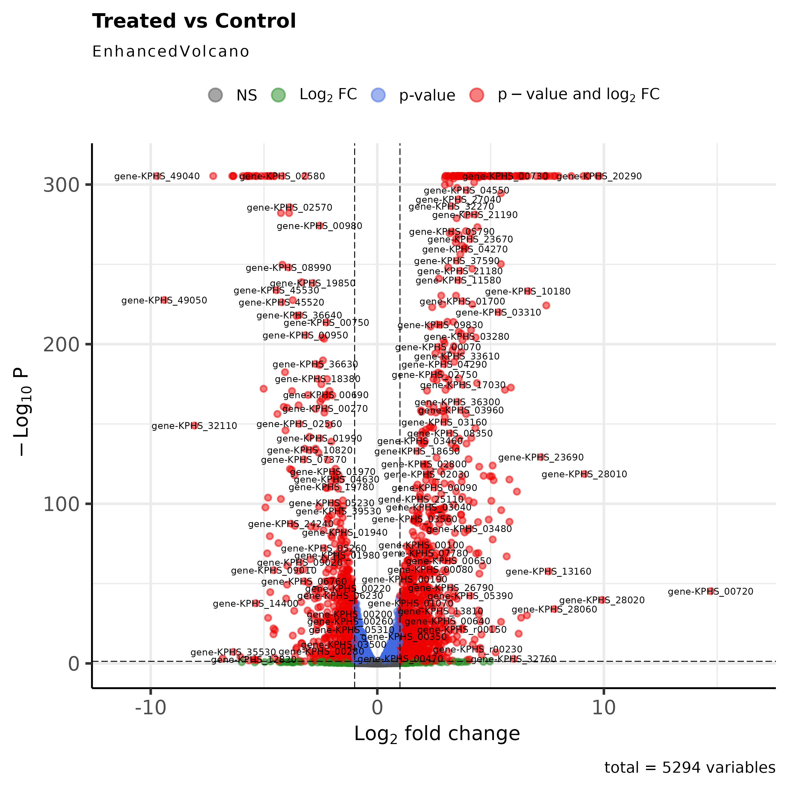

# 🚀 rnaSeq_klebsiella_pipeline

A complete bioinformatics pipeline (FastQC, fastp, HISAT2, featureCounts, DESeq2) for RNA-Seq Differential Gene Expression (DGE) analysis of *Klebsiella pneumoniae*.

This project analyzes data (GSE265435) to identify gene expression changes between Wild Type (WT) strains and mutant strains (ΔcpxR).

---

## 🔬 Key Results

The analysis identified a massive transcriptional shift caused by the `cpxR` deletion.
* **1,833 Genes Up-Regulated** (in mutant vs. WT)
* **1,858 Genes Down-Regulated** (in mutant vs. WT)

The PCA, Volcano, and Heatmap visualizations confirm this clear separation between the two groups (Control vs. Treated):

### PCA Plot (Sample Similarity)


### Volcano Plot (Differentially Expressed Genes)


### Heatmap (Top 50 Genes)


---

## 📁 Project Structure

The entire analysis is performed using a series of Jupyter Notebooks.

* `00_Data_QC.ipynb`: Initial QC of raw FASTQ files (FastQC, MultiQC).
* `01_Download_Data.ipynb`: Downloads reference genome (FASTA/GFF) and SRA data list.
* `02_Trimming.ipynb`: Cleans raw reads (fastp, MultiQC).
* `03_Alignment.ipynb`: Aligns reads to genome (HISAT2, samtools, MultiQC).
* `04_Read_Counting.ipynb`: Generates the gene counts matrix (featureCounts).
* `05_DGE_Analysis.ipynb`: Performs statistical analysis and visualization (R, DESeq2, pheatmap, ggplot2).

---

## ⚙️ How to Run

1.  **Clone Repository:**
    ```bash
    git clone https://github.com/refmyoussef-source/rnaseq_klebsiella_pipeline.git
    cd rnaSeq_klebsiella_pipeline
    ```

2.  **Create Environment:**
    (This requires `mamba` to be installed)
    ```bash
    mamba env create -f environment.yml
    mamba activate rnaseq_pipe
    ```

3.  **Run Notebooks:**
    Launch Jupyter Lab and run the notebooks from `00` to `05` in numerical order.
    ```bash
    jupyter lab
    ```
